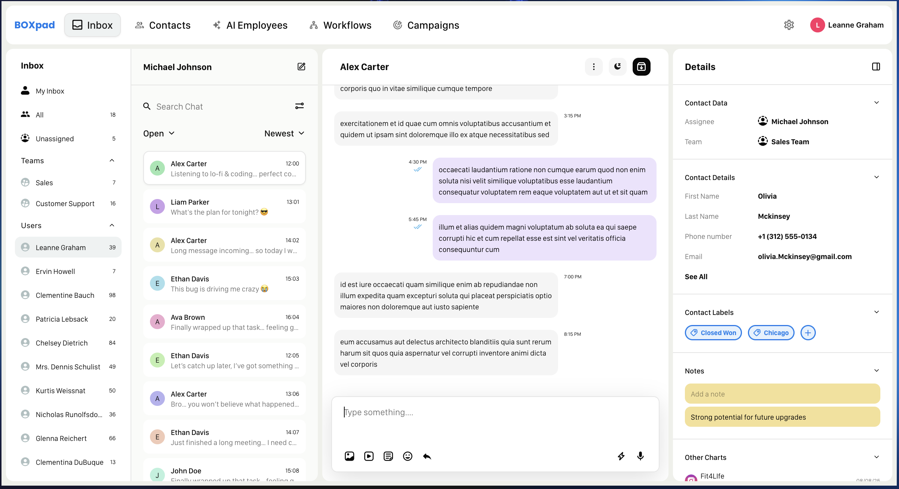
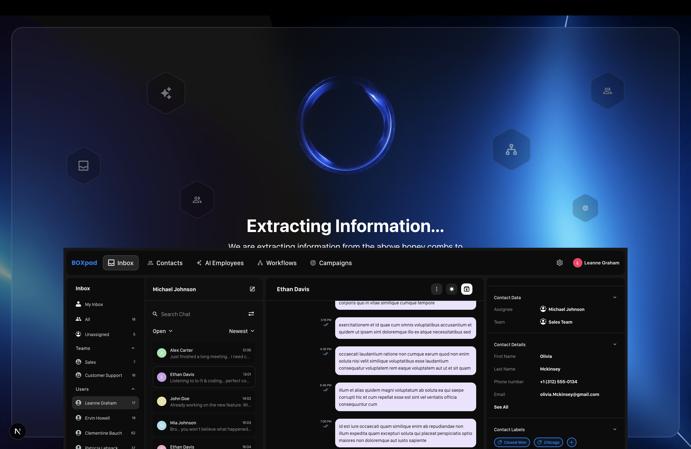
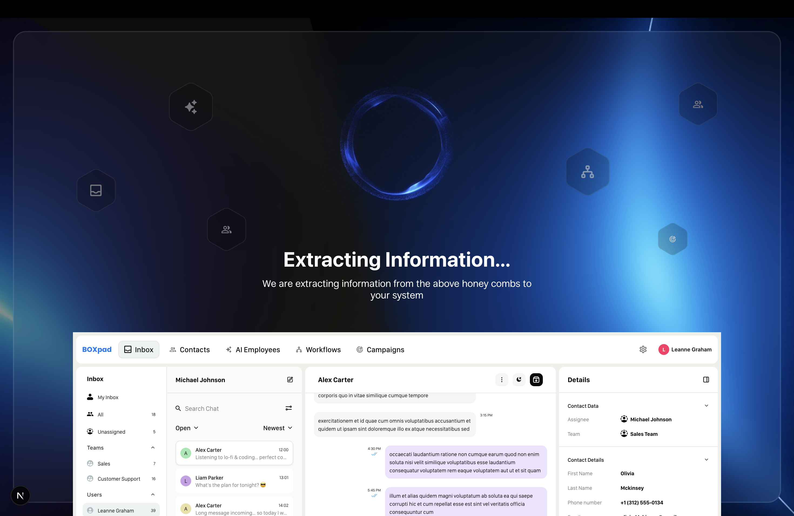
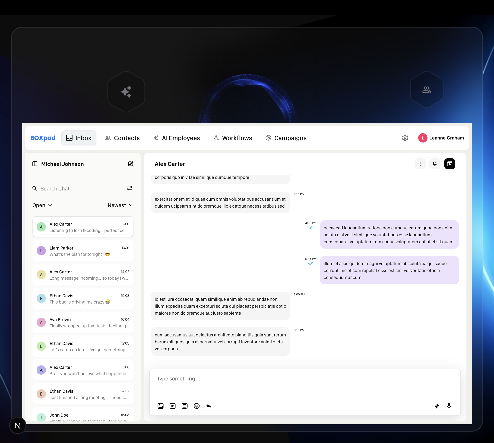
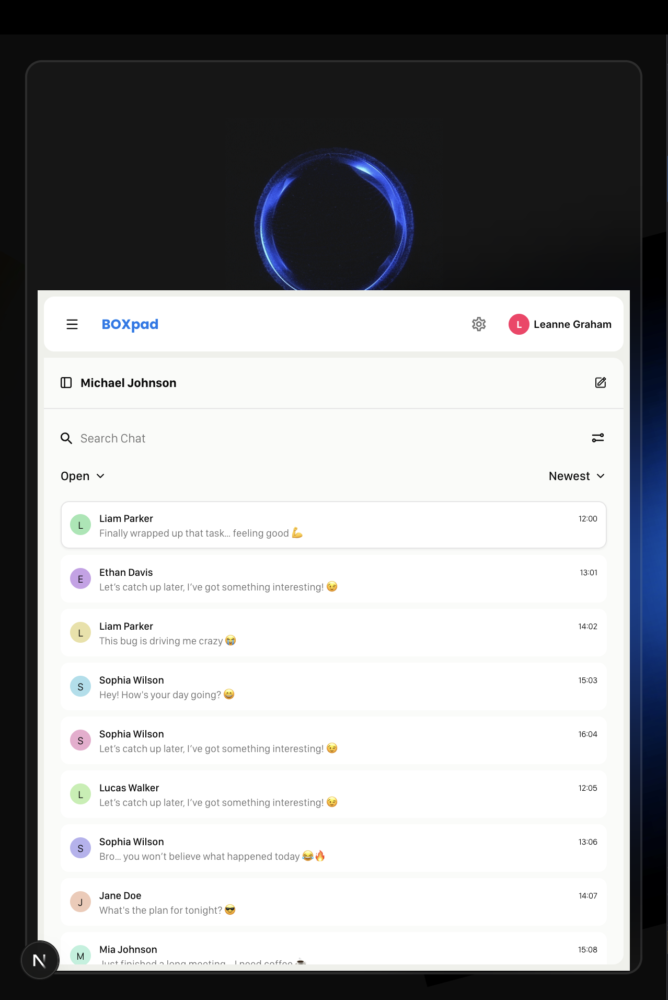
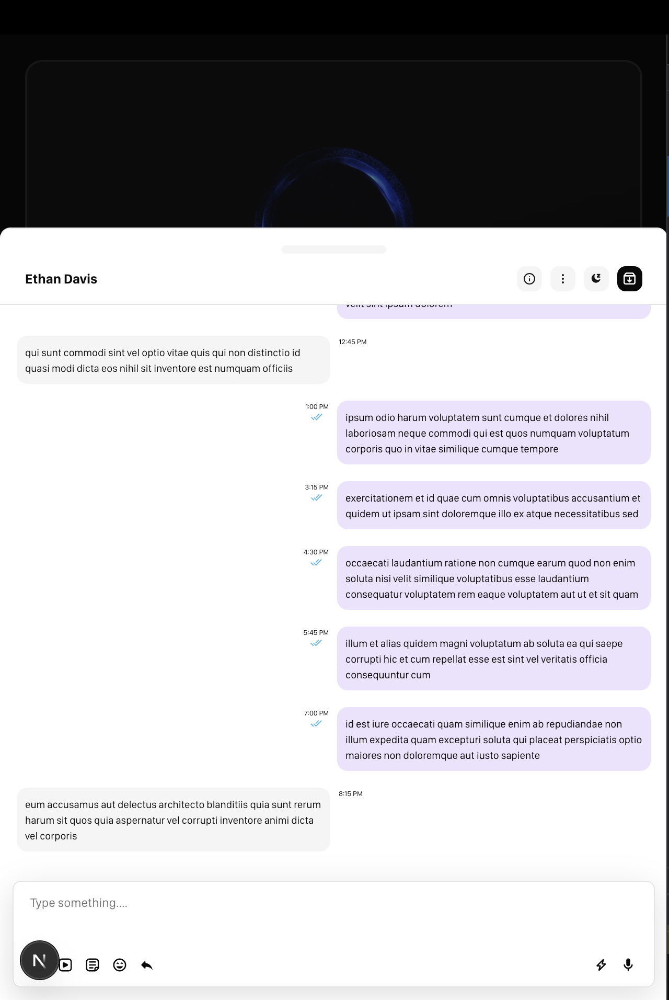
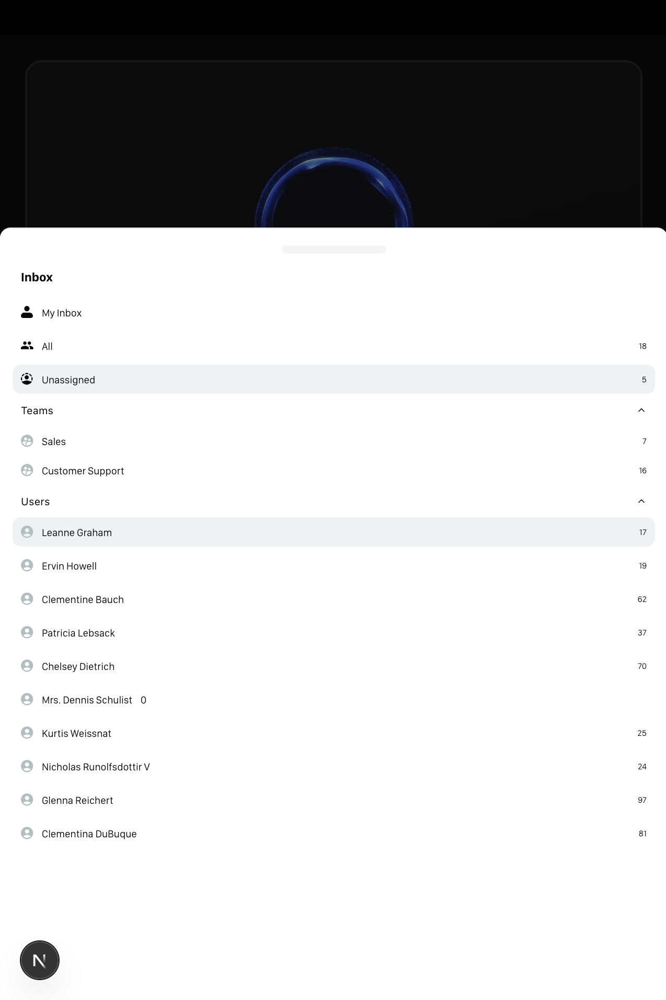
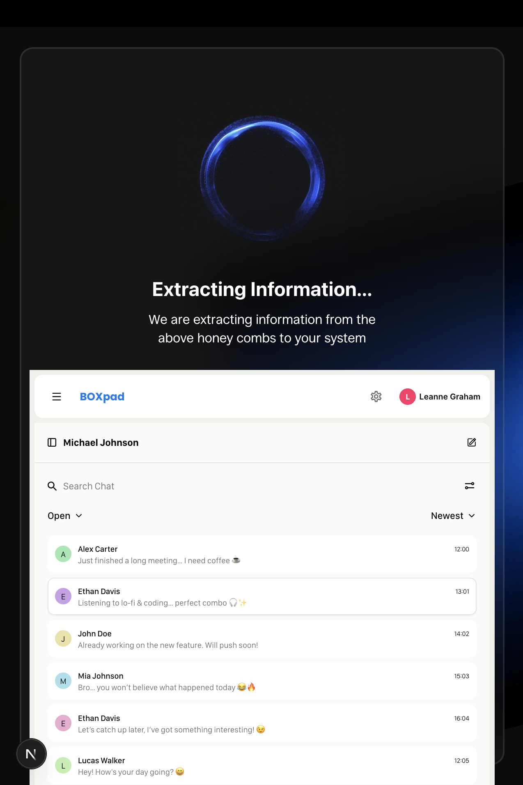

# Modern Chat Dashboard

A beautiful, responsive chat dashboard built with Next.js. Features a sleek interface with dark mode support, real-time chat functionality, and a fully responsive design that works seamlessly across desktop, tablet, and mobile devices.



## ✨ Features

- 🎨 **Dark Mode** - Toggle between light and dark themes with system preference detection
- 📱 **Fully Responsive** - Optimized for desktop, tablet, and mobile devices
- 🎯 **JSON Placeholder Integration** - Fetches user data and messages from JSONPlaceholder API
- 📋 **Drawer Modals** - Sidebar and detail panels that slide in on mobile devices
- 🎨 **Modern UI Components** - Built with shadcn/ui and Radix UI primitives

## 🛠️ Tech Stack

### Core Framework

- **Next.js** `16.0.8` - React framework with App Router
- **React** `19.2.1` - UI library
- **TypeScript** `5.x` - Type safety

### Styling & UI

- **Tailwind CSS** `4.x` - Utility-first CSS framework
- **shadcn/ui** - High-quality component library
- **Radix UI** - Unstyled, accessible component primitives
  - `@radix-ui/react-collapsible` `^1.1.12`
  - `@radix-ui/react-dialog` `^1.1.15`
  - `@radix-ui/react-slot` `^1.2.4`
  - `@radix-ui/react-tooltip` `^1.2.8`
- **Lucide React** `^0.556.0` - Icon library
- **Motion** `^12.23.25` - Animation library
- **Vaul** `^1.1.2` - Drawer component library

### State Management & Data Fetching

- **Zustand** `^5.0.9` - Lightweight state management
- **TanStack Query** `^5.90.12` - Powerful data synchronization
- **Axios** `^1.13.2` - HTTP client

### Utilities

- **next-themes** `^0.4.6` - Dark mode support
- **date-fns** `^4.1.0` - Date manipulation
- **class-variance-authority** `^0.7.1` - Component variants
- **clsx** `^2.1.1` - Conditional classnames
- **tailwind-merge** `^3.4.0` - Merge Tailwind classes

## 📸 Screenshots

### Desktop Views

<div align="center">
  
  <p><em>Main Dashboard - Desktop View</em></p>
</div>

<div align="center">
  
  <p><em>Dark Mode Interface</em></p>
</div>

<div align="center">
  
  <p><em>Landing Page</em></p>
</div>

### Tablet View

<div align="center">
  
  <p><em>Tablet Responsive Design</em></p>
</div>

### Mobile Views

<div align="center">
  
  <p><em>Mobile Dashboard</em></p>
</div>

<div align="center">
  
  <p><em>Mobile Chat Interface</em></p>
</div>

<div align="center">
  
  <p><em>Mobile Navigation Menu</em></p>
</div>

<div align="center">
  
  <p><em>Mobile Landing Page</em></p>
</div>

## 🚀 Getting Started

### Prerequisites

Make sure you have one of the following package managers installed:

- **Node.js** 18+
- **Bun** (recommended)
- **npm** / **yarn** / **pnpm**

### Installation

1. **Clone the repository**

```bash
git clone https://github.com/hanzlah101/assesment.git
cd assesment
```

2. **Install dependencies**

Using Bun (recommended):

```bash
bun install
```

Or using npm:

```bash
npm install
```

Or using yarn:

```bash
yarn install
```

Or using pnpm:

```bash
pnpm install
```

3. **Run the development server**

Using Bun:

```bash
bun dev
```

Or using npm:

```bash
npm run dev
```

Or using yarn:

```bash
yarn dev
```

Or using pnpm:

```bash
pnpm dev
```

4. **Open your browser**

Navigate to [http://localhost:3000](http://localhost:3000) to see the application.

## 🏗️ Self-Hosting

### Build for Production

1. **Build the application**

```bash
bun run build
# or
npm run build
```

2. **Start the production server**

```bash
bun start
# or
npm start
```

## 📁 Project Structure

```
├── app/                    # Next.js App Router pages
├── components/             # React components
│   ├── dashboard/         # Dashboard-specific components
│   ├── ui/                # Reusable UI components
│   └── icons/             # Icon components
├── lib/                   # Utility functions and API config
├── queries/               # TanStack Query hooks
├── stores/                # Zustand state management
├── types/                 # TypeScript type definitions
└── public/                # Static assets
    └── screenshots/      # Screenshot images
```

## 🎯 Key Features Explained

### JSON Placeholder Integration

The application fetches user data, messages, and comments from [JSONPlaceholder](https://jsonplaceholder.typicode.com/), a free fake REST API for testing and prototyping. The data is transformed and displayed in a chat-like interface.

### Dark Mode

Powered by `next-themes`, the application supports:

- System preference detection
- Manual theme switching
- Persistent theme selection
- Smooth theme transitions

### Responsive Design

The dashboard adapts beautifully across all screen sizes:

- **Desktop (xl+)**: Full sidebar, chat, and details panel
- **Tablet (md-xl)**: Collapsible sidebars with drawer modals
- **Mobile (<md)**: Full-screen drawers for chat and details

### State Management

- **Zustand** for global UI state (modals, selected chat, etc.)
- **TanStack Query** for server state and data fetching
- Fine-grained reactivity with selector-based subscriptions

---

Built with ❤️ using Next.js and modern web technologies.
